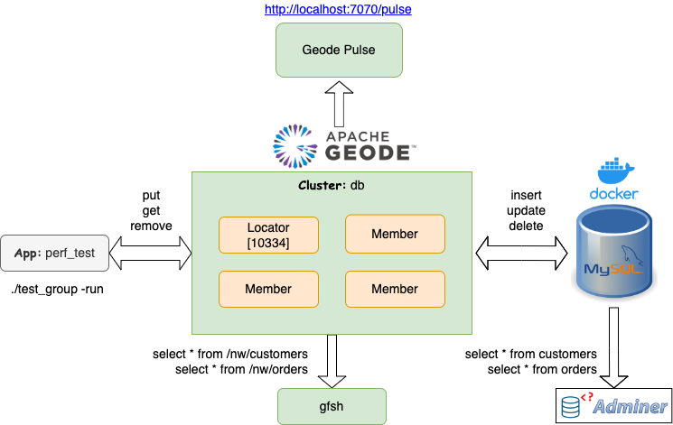
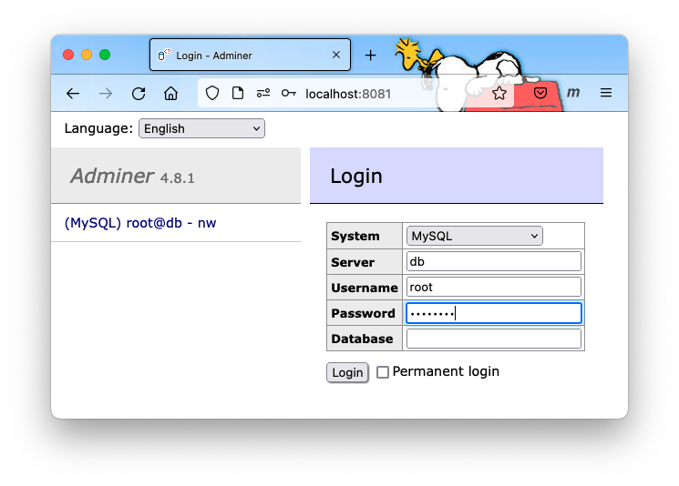
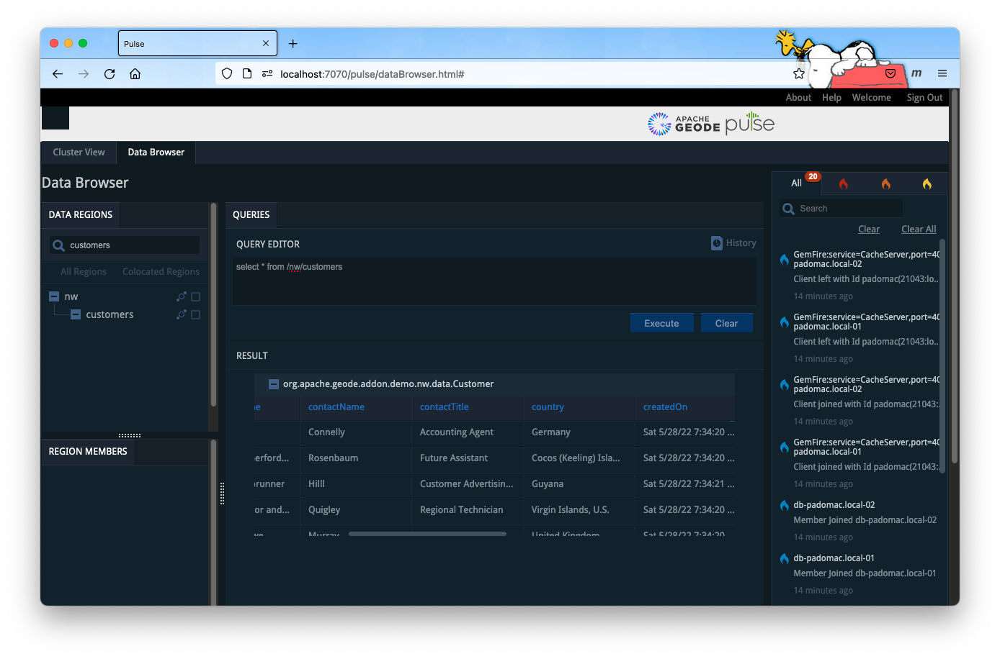
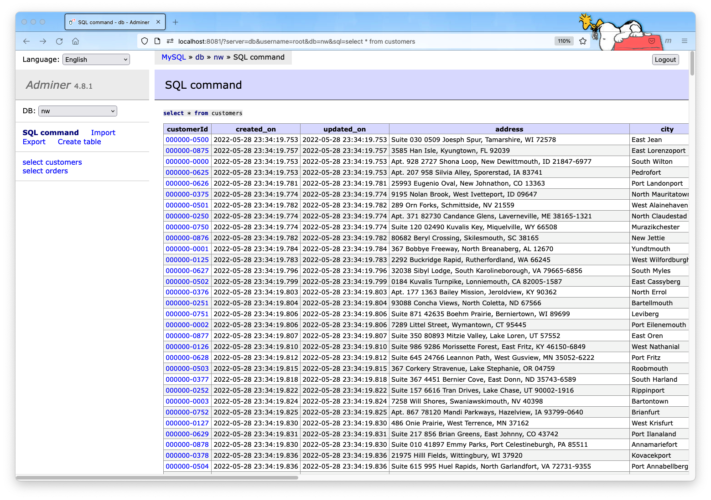

# Bundle: MySQL Sync

This bundle is preconfigured to synchronize Geode/GemFire with MySQL running as a Docker container. It includes the `db` cluster app to read/write from/to Geode/GemFire and MySQL. It also includes instructions for replacing MySQL with another database.

## Installing Bundle

```bash
#witch_rwe rwe-bundles bundle-geode-1-docker-dbsync_mysqlInstal in the current workspace
install_bundle -download bundle-geode-1-docker-dbsync_mysql

# Install in the new bundle default workspace
install_bundle -download -workspae bundle-geode-1-docker-dbsync_mysql

# Install in the new bundle default workspace with git intact
install_bundle -checkout bundle-geode-1-docker-dbsync_mysql
```

## Use Case

The client applications read/write from/to Geode/GemFire which in turn read/write from/to a database. The database is used as the persistent store and Geode/GemFire as the bidirectional cache-aside store. The Geode/GemFire maps are configured with the LFU eviction policy to evict entries if the free heap size falls below 25% of the maximum heap size. This ensures the Geode/GemFire cluster will have at least 25% of free memory at all time which is necessary for executing distributed operations such as query and task executions.




## Bundle Contents

```console
clusters
└── db

docker
└── dbsync_mysql
```

## Configuring Bundle Environment

### MySQL

The `db` cluster has been preconfigured to connect to MySQL on localhost with the user name `root` and the password `MySql123`. If you need to change user name and password, edit `etc/hibernate.cfg-mysql.xml`.

```console
switch_cluster db
vi etc/hibernate.cfg-mysql.xml
```

### Create and build `perf_test_db`

We will use the `perf_test` app included in PadoGrid to ingest data into the Geode/GemFire cluster.

```console
# Create perf_test with the name 'perf_test_db'
create_app -name perf_test_db

# We need to download the MySQL binary files by building `perf_test_db` as follows.
cd_app perf_test_db; cd bin_sh
./build_app
```

## Startup Sequence

```console
# 1. Add a locator and at least two (2) members to the `db` cluster. All bundles come without members.
switch_cluster db
add_locator; add_member; add_member

# 2. Run the cluster.
start_cluster

# 3. Monitor the log file. Hibernate has been configured to log SQL statements
#    executed by the CacheWriterLoaderPkDbImpl plugin.
show_log

# 4. Open another terminal and launch Docker Compose.
cd_docker dbsync_mysql
docker-compose up
```

5. The Docker Compose environment includes *Adminer*. Open it in the browser and add the **nw** database in which we will be syncronizing Geode/GemFire the `nw/customers` and `nw/orders` maps. When you run the `test_group` script (see below), the `customers` and `orders` tables will automatically be created in the `nw` database by Hibernate invoked by the `CacheWriterLoaderPkDbImpl` plugin.

Adminer URL: http://localhost:8081

```console
Username: root
Password: MySql123
Database to create: nw
```



6. Ingest data

The `test_group` script creates mock data for `Customer` and `Order` objects and ingests them into the Geode/GemFire cluster which in turn writes to MySQL via the `CacheWriterLoaderPkDbImpl` plugin included in the PadoGrid distribution. The same plugin is also registered to retrieve data from MySQL for cache misses in the cluster.

```console
cd_app perf_test_db; cd bin_sh
./test_group -prop ../etc/group-factory.properties -run
```

You should see SQL statements being logged if you are running `show_log`.

7. View data in Geode/GemFire using `gfsh`

Start gfsh:

```bash
gfsh
```

From `gfsh` prompt, execute queries:

```console
# Connect to the Geode cluster
connect --locator=localhost[10334]

# Set viwer to external see wider results
set variable --name=APP_RESULT_VIEWER --value=external

# Query
query --query="select * from /nw/customers"
query --query="* from /nw/orders"
```

Output:

```console
Result : true
Limit  : 100
Rows   : 100

  createdOn   |   updatedOn   |    orderId    |  customerId   |  employeeId   |   orderDate   | requiredDate  |  shippedDate  | >
------------- | ------------- | ------------- | ------------- | ------------- | ------------- | ------------- | ------------- | >
1653780864087 | 1653780864087 | "k0000000507" | "000000-0032" | "743852+2379" | 1653648619865 | 1654347428530 | 1653851334600 | >
1653780864674 | 1653780864674 | "k0000000921" | "000000-0069" | "275216+5010" | 1653709244781 | 1654203505536 | 1653930797388 | >
1653780865772 | 1653780865772 | "k0000000246" | "000000-0031" | "156647+4161" | 1653657463919 | 1654485933209 | 1653808276471 | >
1653780864604 | 1653780864604 | "k0000000665" | "000000-0041" | "869253+8962" | 1653239063936 | 1654021039572 | 1653641358786 | >
1653780865603 | 1653780865603 | "k0000000486" | "000000-0086" | "401486-7602" | 1653313715518 | 1653472260037 | 1653589506543 | >
1653780864159 | 1653780864159 | "k0000000263" | "000000-0020" | "668479+9129" | 1653552418996 | 1653971345292 | 1653561386259 | >
1653780864241 | 1653780864241 | "k0000000019" | "000000-0035" | "308644+0336" | 1653194074130 | 1653996315071 | 1653382193282 | >
1653780865330 | 1653780865330 | "k0000000714" | "000000-0044" | "507709-0879" | 1653490294204 | 1653532847889 | 1653701386065 | >
1653780864671 | 1653780864671 | "k0000000420" | "000000-0064" | "801823-7795" | 1653681106301 | 1654329775487 | 1654007008834 | >
1653780864247 | 1653780864247 | "k0000000395" | "000000-0013" | "577014-4050" | 1653581735042 | 1653873902194 | 1653992836042 | >
1653780864530 | 1653780864530 | "k0000000412" | "000000-0059" | "801885+2534" | 1653484023273 | 1653909938460 | 1653806676319 | >
1653780864897 | 1653780864897 | "k0000000683" | "000000-0055" | "948682-6556" | 1653234907286 | 1653437545764 | 1653338913759 | >
1653780865527 | 1653780865527 | "k0000000480" | "000000-0008" | "348796-1949" | 1653715632146 | 1653776684564 | 1653723975534 | >
1653780865388 | 1653780865388 | "k0000000593" | "000000-0083" | "030442+0108" | 1653602574848 | 1654281337283 | 1653983949393 | >
1653780865034 | 1653780865034 | "k0000000068" | "000000-0090" | "102682+0517" | 1653664645984 | 1653860921936 | 1653982658967 | >
1653780864635 | 1653780864635 | "k0000000667" | "000000-0025" | "848853+7049" | 1653315041686 | 1654124258722 | 1653379733391 | >
1653780865068 | 1653780865068 | "k0000000446" | "000000-0076" | "712278+5902" | 1653483476863 | 1653521981163 | 1653504051825 | >
1653780863990 | 1653780863990 | "k0000000001" | "000000-0059" | "097525+6996" | 1653485090441 | 1654251011343 | 1653770780459 | >
1653780864348 | 1653780864348 | "k0000000652" | "000000-0072" | "453380-1015" | 1653324130284 | 1654052346432 | 1653685603196 | >
1653780864912 | 1653780864912 | "k0000000059" | "000000-0093" | "472717+7565" | 1653492836783 | 1653708893577 | 1653665835407 | >
1653780864382 | 1653780864382 | "k0000000529" | "000000-0003" | "323643+6147" | 1653710011976 | 1653996754040 | 1654137087656 | >
1653780864260 | 1653780864260 | "k0000000271" | "000000-0058" | "615319-4712" | 1653778304421 | 1654267741083 | 1654167530667 | >
...
```

8. View Geode/GemFire using Pulse

You can use Pulse to view data.

URL: http://localhost:7070/pulse

Using the SQL Browser, execute the following queries.

```sql
select * from "/nw/customers";
select * from "/nw/orders";
```



9. View MySQL using Adminer

From Adminer, execute the following queries.

```sql
select * from customers;
select * from orders;
```



## Replacing MySQL with Another Database

If you have a database other than MySQL then you need to download the appropriate JDBC driver and update the Hibernate configuration file. The JDBC driver can be downloaded by adding the database dependency in the `pom.xml` file in the `perf_test_db` directory and run the `build_app` command as shown below.

```console
cd_app perf_test_db
vi pom.xml
```

The following shows the PostgresSQL dependency that is already included in the `pom.xml` file.

```xml
<!-- https://mvnrepository.com/artifact/org.postgresql/postgresql -->
<dependency>
   <groupId>org.postgresql</groupId>
   <artifactId>postgresql</artifactId>
   <version>42.2.8</version>
</dependency>
```

Build the app. The `build_app` command downloads your JDBC driver and automatically deploys it to the `$PADOGRID_WORKSPACE/lib` directory.

```console
cd bin_sh
./build_app
```

Configure Hibernate. Copy the `etc/hibernate.cfg-mysql.xml` file in the cluster directory to a file with another name, e.g., `hibernate.cfg-mydb.xml` and include the driver and login information in the new file.

```console
cd_cluster
cp etc/hibernate.cfg-mysql.xml etc/hibernate.cfg-mydb.xml
vi etc/hibernate.cfg-mydb.xml
```

Set the cluster to the new Hibernate configuration file. Edit `bin_sh/setenv.sh` and set the `HIBERNATE_CONFIG_FILE` environment variable to the new Hibernate configuration file name.

```console
cd_cluster
vi bin_sh/setenv.sh
```

For our example, you would set `HIBERNATE_CONFIG_FILE` in the `bin_sh/setenv.sh` file as follows:

```bash
HIBERNATE_CONFIG_FILE="$CLUSTER_DIR/etc/hibernate.cfg-mydb.xml"
```

## Teardown

```console
# Stop the cluster.
stop_cluster

# Stop Docker Compose
cd_docker dbsync_mysql
docker-compose down
```
